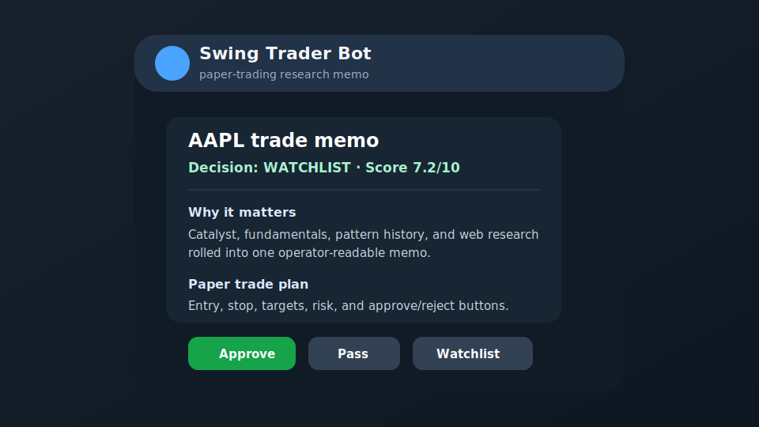
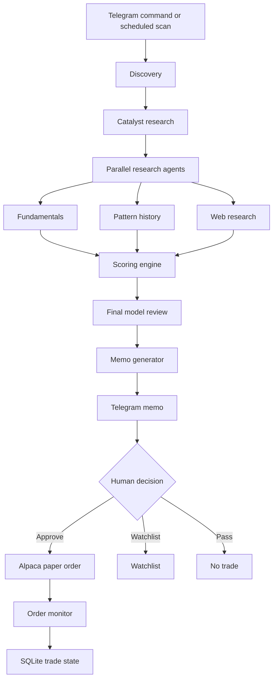

# Swing Trader

[](https://github.com/niyonzimabryan/swingtrader/actions/workflows/ci.yml)

Swing Trader turns a ticker into a Telegram trade memo, then lets you approve or reject a paper trade with human control in the loop.

Important: this is paper-trading research software, not financial advice. Use Alpaca paper keys only unless you have personally reviewed the code, strategy, broker integration, and risk controls. Every trade needs human review.

Read these before setup:

- [Financial disclaimer](DISCLAIMER.md)
- [MIT license](LICENSE)



## Why it exists

Most trading bots hide the thinking and jump straight to execution. Swing Trader does the opposite: it gathers evidence, writes a memo, shows the trade plan in Telegram, and waits for you to approve.

It is built for people who want to test an AI-assisted swing-trading workflow without giving an agent unsupervised live-broker authority.

## Quickstart: first Telegram memo in under 15 minutes

You need Python 3.11+, a Telegram account, and API keys for Anthropic, Alpaca paper trading, and market-data providers. The setup wizard walks through the required keys and writes your local .env file.

1. Clone and enter the repo.

```bash
git clone https://github.com/niyonzimabryan/swingtrader.git
cd swingtrader
```

2. Create a virtualenv and install dependencies.

```bash
python -m venv .venv
.venv/bin/python -m pip install -r requirements.txt
```

3. Run the setup wizard.

```bash
.venv/bin/python -m scripts.setup_wizard
```

Open this URL when the wizard starts:

```text
http://localhost:8765
```

The wizard will:

- create .env
- validate required keys
- discover TELEGRAM_CHAT_ID after you message your bot
- send a Telegram setup test message
- keep Gemini and Langfuse as optional add-ons

4. Run the doctor.

```bash
.venv/bin/python -m scripts.doctor --skip-live
```

When .env is filled in, run the live checks too:

```bash
.venv/bin/python -m scripts.doctor
```

5. Start the bot with the scheduler paused.

```bash
SCHEDULER_ENABLED=false .venv/bin/python main.py
```

Do not run this locally while another deployed instance is polling the same Telegram bot. Telegram only allows one polling connection.

6. In Telegram, send your bot a test request.

```text
/eval AAPL Strong services growth and buyback support
```

You should receive a research memo with the setup, score, risks, suggested paper-trade parameters, and action buttons.

## What it does

Swing Trader has two jobs: produce better trade memos, and keep paper-trade operations from drifting after approval.

1. Discovery finds candidates.
   - Scheduled scans look across the configured universe.
   - Ad-hoc `/eval TICKER thesis` skips the broad scan and researches one idea.

2. Research builds the case.
   - Catalyst, fundamental, pattern, macro, and web-research agents collect evidence.
   - The pipeline scores the evidence and asks a stronger model for the final judgment when needed.

3. Memo delivery turns research into an operator decision.
   - Telegram receives the memo.
   - You approve, reject, or watchlist.
   - Approved trades go to Alpaca paper trading by default, or to Robinhood Agentic Trading when you explicitly select Robinhood live mode.

After approval, the order monitor polls the active broker, tracks fills, watches stops and targets where supported, and keeps trade state in SQLite.

## Cost expectations

These numbers come from the Langfuse evidence pass for BRY-66. Caveat: Langfuse had no traces from 2026-05-01 through 2026-05-15, so the baseline uses available data from 2026-03-01 through 2026-04-30.

Observed API cost:

| Run type | Observed runs | Average | p50 | p95 |
|---|---:|---:|---:|---:|
| Scheduled scan | 11 | $1.34/scan | $0.78 | $3.26 |
| Ad-hoc `/eval` memo | 13 | $0.18/eval | $0.09 | $0.47 |

Planning numbers:

- 10 ad-hoc `/eval` runs cost about $1.76 at the observed average.
- 3 scheduled scans per weekday means about 66 scans/month.
- At the observed average, that is about $88.76/month.
- At observed p95 cost every time, budget about $215.04/month.

Main cost driver: web research. It was 66.4% of observed Langfuse spend, averaging $0.21 per web-research call. The BRY-66 code defaults now cap web research at 5 searches per call and reuse same-day ticker/catalyst results through the SQLite web-research cache.

These are model/provider costs only. They do not include broker fees, market-data subscription upgrades, hosting, or your local machine.

## Limitations

- Paper trading first. The default mode is Alpaca paper trading.
- Robinhood live trading requires a dedicated Agentic account, `BROKER_PRIMARY=robinhood`, `EXECUTION_MODE=live`, `ALLOW_LIVE_TRADING=true`, and `ROBINHOOD_ACCOUNT_NUMBER`.
- Robinhood OAuth setup is optional and documented in [Robinhood Integration Guide](docs/ROBINHOOD_INTEGRATION_PLAN.md) and [Robinhood OAuth Token Store](docs/ROBINHOOD_TOKEN_STORE.md).
- US equities only.
- Phase 1 is long-only. Short-side parameters are not production-ready.
- Swing horizon, roughly days to weeks. This is not a day-trading scalper.
- Human approval is required. The bot should not be treated as an unattended live trader.
- Model output can be wrong, stale, incomplete, or overconfident.
- Scheduled-scan cost telemetry still has gaps. Use Langfuse or add a DB run ledger before making spend-sensitive changes.

## Architecture



Important code paths:

- agents/: catalyst, fundamental, pattern, macro, discovery, web research, deep research
- orchestrator/pipeline.py: scan and ad-hoc pipeline
- orchestrator/scheduler.py: scheduled scans
- memo/generator.py and memo/templates/: memo assembly
- bot/: Telegram handlers, formatting, keyboards, notifications
- execution/: Alpaca paper order execution and monitoring
- database/: SQLAlchemy models and SQLite session handling

## Configuration knobs

Use the setup wizard first. Edit .env directly only after you understand the flow.

Core required settings:

| Variable | Why it matters |
|---|---|
| ANTHROPIC_API_KEY | Core analysis, scoring, memo writing, and Anthropic web search fallback |
| TELEGRAM_BOT_TOKEN | Telegram bot access |
| TELEGRAM_CHAT_ID | Restricts bot commands to your chat |
| ALPACA_API_KEY | Alpaca paper broker key |
| ALPACA_SECRET_KEY | Alpaca paper broker secret |
| ALPACA_BASE_URL | Keep this on https://paper-api.alpaca.markets for paper trading |
| FINNHUB_API_KEY | News, earnings, recommendations, price targets |
| FMP_API_KEY | Fundamentals and fallback pattern data |
| ALPHA_VANTAGE_API_KEY | Backup financial data provider |
| FRED_API_KEY | Macro rates, yield curve, credit spreads |
| DATABASE_URL | Local default: sqlite:///swing_trader.db |
| SCHEDULER_ENABLED | Start with false; set true only after `/eval` works |

Broker controls:

| Variable | Default | Why it matters |
|---|---:|---|
| BROKER_PRIMARY | alpaca | Selects the live/review broker; set to robinhood for Agentic Trading |
| EXECUTION_MODE | paper | `review_only`, `paper`, or `live` |
| ALLOW_LIVE_TRADING | false | Hard gate before any live broker placement |
| ROBINHOOD_ACCOUNT_NUMBER | blank | Dedicated Agentic account used by Robinhood MCP tools |
| ROBINHOOD_MAX_ORDER_NOTIONAL | 5 | Per-order Robinhood micro-trading cap |
| ROBINHOOD_MAX_DAILY_NOTIONAL | 10 | Daily Robinhood live notional cap |
| TOKEN_ENCRYPTION_KEY | blank | Enables encrypted Robinhood OAuth token storage |

Telegram broker commands:

```text
/broker
/broker accounts
/broker robinhood ACCOUNT_NUMBER
/broker robinhood 1
/broker alpaca
/mode review
/mode paper
/mode live
/orders
/attr
```

Robinhood OAuth bootstrap:

```bash
.venv/bin/python -m scripts.robinhood_auth --gen-key
.venv/bin/python -m scripts.robinhood_auth
.venv/bin/python -m scripts.robinhood_auth --status
```

`robinhood_token.enc` is local runtime state and must never be committed.

Cost and research controls:

| Variable | Default | Why it matters |
|---|---:|---|
| WEB_SEARCH_PROVIDER | gemini | Routes search-heavy stages to Gemini when configured |
| GEMINI_API_KEY | blank | Optional, recommended for grounded search-heavy stages |
| DISCOVERY_MAX_SEARCHES | 8 | Caps discovery search breadth |
| WEB_RESEARCH_MAX_SEARCHES | 5 | Biggest spend lever; caps per-call search breadth |
| WEB_RESEARCH_CACHE_ENABLED | true | Reuses same-day ticker/catalyst web research from SQLite before calling the provider |
| WEB_RESEARCH_CACHE_TTL_HOURS | 24 | Cache expiry window; keep at 24 for same-day reuse |
| LANGFUSE_PUBLIC_KEY / LANGFUSE_SECRET_KEY | blank | Optional observability and cost tracing |

Risk controls:

| Variable or setting | Default shown in app | Why it matters |
|---|---:|---|
| drawdown_circuit_breaker_pct | 10% | Stops trading after severe drawdown |
| daily_loss_halt_pct | 3% | Stops trading after daily loss limit |
| max_concurrent_positions | 8 | Caps portfolio concentration by count |
| max_position_pct | 10% | Caps single-position exposure |
| max_stop_loss_pct | 8% | Caps allowed stop distance |

See .env.example for the full list.

## Development and tests

Run the same checks as CI:

```bash
.venv/bin/python -m pip check
.venv/bin/python -m compileall -q agents bot config data database execution memo orchestrator scanning scoring screening scripts tracking utils main.py
.venv/bin/python -m unittest discover -s tests -p "test_*.py"
```

For onboarding or credential changes, also run:

```bash
.venv/bin/python -m scripts.doctor --skip-live
```

Public pull requests should not require secrets. Prefer deterministic unit tests with fake provider responses.

## Contributing

Read CONTRIBUTING.md before opening a pull request.

Good first areas:

- setup and onboarding clarity
- deterministic tests around provider parsing and fallbacks
- Telegram memo formatting and chunking
- paper-trading safety checks
- cost observability and run logging

Do not submit changes that make live trading unattended or hide the human approval step.

## License and disclaimer

Swing Trader is released under the MIT License. See LICENSE.

This project is not financial, investment, tax, or legal advice. It is research and paper-trading software. You are responsible for your own trading decisions and losses. Read DISCLAIMER.md before using it.
