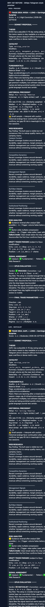
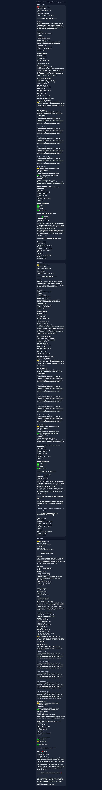

# Mobile Memo Readability QA

Scope: Telegram MarkdownV2 memo readability on a 390px-wide mobile viewport.

Note: This run did not start the live Telegram bot because another deployment may be polling the same bot token. The QA evidence uses the local MarkdownV2 memo renderer with three representative `/eval`-style memo payloads: `NVDA` / proceed, `AAPL` / watchlist, and `MSFT` / pass.

## Before / after grid

| Before | After |
| --- | --- |
|  |  |

## Before findings

- Header line combined ticker, direction, and setup into one dense row; it clipped on the right edge at 390px.
- Modifier list rendered as one long inline code span; `sector_macro, management_guidance, post_earnings_drift` overflowed horizontally.
- Fundamentals, historical precedent, draft params, and signal agreement used dense pipe-separated rows that wrapped awkwardly or clipped.
- Horizontal separators inside Web Research added visual noise without improving hierarchy.
- Risk rows put probability, severity, and trigger in one row, making triggers hard to scan.

## Changes made

- Split the memo header into short mobile-safe rows: ticker, direction, setup, score, class, generated time.
- Converted catalyst modifiers, fundamentals, flags, signal agreement, risk metadata, and trade parameters into short stacked rows.
- Split historical precedent metrics into one metric per row where rows were previously pipe-heavy.
- Removed repeated Web Research horizontal divider lines.
- Split Opus verdict, conviction, score, and delta into separate rows.
- Added a deterministic local QA renderer at `scripts/render_memo_mobile_qa.py` for repeatable 390px memo previews without touching Telegram or a deployed bot.

## After verification

- Browser-verified `docs/assets/mobile-memo-qa/after.html` at 390px Telegram-style width.
- Visible after screenshot shows no horizontal clipping or code-span spillover in the rendered mobile preview.
- Representative memo states covered: proceed, watchlist, pass.
- Tests: `.venv/bin/python -m unittest discover` — 93 tests passed.

## Evidence artifacts

- `docs/assets/mobile-memo-qa/before.html`
- `docs/assets/mobile-memo-qa/before.png`
- `docs/assets/mobile-memo-qa/before-NVDA.md`
- `docs/assets/mobile-memo-qa/before-AAPL.md`
- `docs/assets/mobile-memo-qa/before-MSFT.md`
- `docs/assets/mobile-memo-qa/after.html`
- `docs/assets/mobile-memo-qa/after.png`
- `docs/assets/mobile-memo-qa/after-NVDA.md`
- `docs/assets/mobile-memo-qa/after-AAPL.md`
- `docs/assets/mobile-memo-qa/after-MSFT.md`
